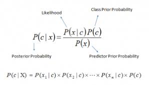

# Naive Bayes

## Overview
Implement a supervised Naive Bayes classifier, and an unsupervised Naive
Bayes classifier. We will also evaluate their behaviour on some standard data sets,
and then respond to some conceptual questions.

## Naive Bayes Classifiers
There are numerous ways to implement the Naive Bayes classifiers. The implementation will
include
- **preprocess()**, to opens the data file, and converts it into a usable information
- **train()**, calculate counts (or probabilities) from the training data to build model
- **predict()**, using model from train() to predict class for the test data
- **evaluate()**, output the evaluation metric, or sufficient information to recalculate by hand  

## Data
1. **breast-cancer.csv**, having 286 instances, 9 nominal attributes (some of which contain
digits), and two classes: no-recurrence-events and recurrence-events. A small
number of attribute values are missing, and marked with ?: you may deal with them as you see
fit (https://archive.ics.uci.edu/ml/datasets/Breast+Cancer).
2. **car.csv**, having 1728 instances, 6 nominal attributes (some of which contain digits), and
four classes: acc and unacc and good and vgood (https://archive.ics.uci.edu/ml/datasets/Car+Evaluation).
3. **hypothyroid.csv**, having 3163 instances, 18 nominal attributes, and two classes: hypothyroid
and negative. A small number of attribute values are missing, and marked with ?: you may
deal with them as you see fit (https://archive.ics.uci.edu/ml/datasets/Thyroid+Disease).
4. **mushroom.csv**, having 8124 instances, 22 nominal attributes, and two classes: e (edible)
and p (poisonous). A large number of attribute values are missing, and marked with ?: you
may deal with them as you see fit (https://archive.ics.uci.edu/ml/datasets/Mushroom).

## Questions
1. Since we’re starting off with random guesses, it might be surprising that the unsupervised NB
works at all. Explain what characteristics of the data cause it to work pretty well (say, within
10% Accuracy of the supervised NB) most of the time; also, explain why it utterly fails sometimes.
2. When evaluating supervised NB across the four different datasets, you will observe some variation
in effectiveness (e.g. Accuracy). Explain what causes this variation. Describe and explain
any particularly suprising results.
3. Evaluating the model on the same data that we use to train the model is considered to be a major
mistake in Machine Learning. Implement a hold–out (hint: check out numpy.shuffle())
or cross–validation evaluation strategy. How does your estimate of Accuracy change, compared
to testing on the training data? Explain why. (The result might surprise you!)
4.  Implement one of the advanced smoothing regimes (add-k, Good-Turing). Do you notice any
variation in the predictions made by either the supervised or unsupervised NB classifiers? Explain
why, or why not.
5. The lecture suggests that deterministically labelling the instances in the initialisation phase of
the unsupervised NB classifier “doesn’t work very well”. Confirm this for yourself, and then
demonstrate why.
6. Rather than evaluating the unsupervised NB classifier by assigning a class deterministically,
instead calculate how far away the probabilistic estimate of the true class is from 1 (where
we would be certain of the correct class), and take the average over the instances. Does this
performance estimate change, as we alter the number of iterations in the method? Explain why.
7.  Explore what causes the unsupervised NB classifier to converge: what proportion of instances
change their prediction from the random assignment, to the first iteration? From the first to
the second? What is the latest iteration where you observe a prediction change? Make some
conjecture(s) as to what is occurring here.
